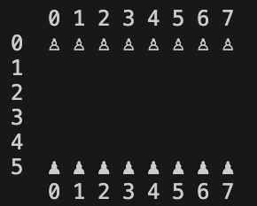

silly terminal game to move pawns.



execute:
```sh
java menu.java
```

to play:
 - Type the initial position of the pawn you want to move (x,y) as xy (E.g. 20).
 - Press Enter.
 - Type the final position where you want to place the pawn as xy (E.g. 21).
 - Press Enter
